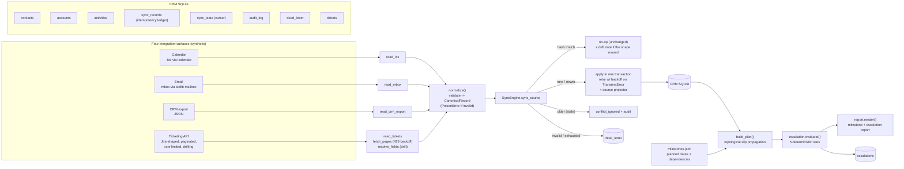

# integration-sync-sketch

A small, honest study of the patterns behind **syncing four unrelated systems into one
place and keeping them correct**: a calendar (ICS files), a mailbox (mbox), a CRM-shaped
database, and a ticketing API. The sync is **idempotent** (safe to run again and again),
**incremental** (does only new work each run), and survives **duplicates, malformed
records, flaky dependencies, rate limits, and a source that changes shape underneath it**
without losing data.

On top of the synced data sits a **project layer**: milestones with planned versus actual
dates, dependencies between them, derived slip, and a deterministic rule set that flags
what is at risk and why.

**What it is in one line:** an independent, weekend-scale demo of integration-sync
engineering: natural keys, content hashes, cursors, a documented conflict policy, retry
with backoff, rate-limit handling, schema-drift tolerance, a dead-letter queue, and a
milestone risk layer, on synthetic self-authored data.

**What it is NOT:** a real connector. There are no real calendars, inboxes, CRMs, Jira
instances, credentials, or network calls. Every person, company, event, ticket, and message
here is invented, labeled `SYNTHETIC`, and uses reserved non-resolvable domains.

---

## The 30-second version

Four systems hold overlapping information about the same work:

- a **calendar** (real `.ics` files) of meetings,
- a **mailbox** (real `mbox` file) of emails,
- a **CRM export** (JSON) of notes and tasks logged elsewhere, and
- a **ticketing API** (Jira-shaped, paginated, rate limited, and drifting).

A **sync engine** reads all four and writes each item once into a single CRM database as
an **activity** attached to a **contact** and an **account**. The hard part is not the
reading; it is staying correct when the same thing shows up twice, arrives out of order,
is broken, gets throttled, changes shape, or the write fails halfway. This engine:

- never creates a duplicate (same item synced twice is a **no-op**),
- only does new work each run (an **incremental cursor** skips what it already has),
- resolves a genuine change with a **documented last-write-wins policy** and writes an
  **audit trail** of every decision,
- **retries** a flaky write with growing pauses,
- **backs off** when a source refuses it for quota, honoring the server's own `Retry-After`,
- **absorbs schema drift** (a renamed field, a scalar that became an object, a field nobody
  declared) without mistaking it for a content change, and
- sends anything it truly cannot process to a **dead-letter queue** for later, instead of
  crashing or silently dropping it.

Then a **project layer** answers the question the raw data does not: given a plan of dated
milestones, which ones are late, which ones are *going* to be late because something
upstream ran long, and which open ticket is the reason.

Three runnable demos prove it:

```bash
python scripts/run_demo.py        # happy path: sync 3 file sources, then prove a re-run changes nothing
python scripts/failure_demo.py    # inject duplicates, bad records, and flaky writes; watch each handled
python scripts/milestone_demo.py  # sync a throttled, drifting ticket board; project slip; raise escalations
```

---

## For engineers

### Architecture



### The five guarantees and how each is earned

| Guarantee | Mechanism | Where |
|---|---|---|
| **Idempotent** | every record has a source **natural key**; a **content hash** is stored per key in `sync_records`. Matching hash -> no writes, no audit rows. Duplicates in a batch collapse the same way. | `hashing.py`, `sync_engine._apply_once` |
| **Incremental** | a per-source **cursor** (high-water mark) in `sync_state`; the reader is handed the cursor and yields only records strictly newer. Cursor advances to the newest timestamp handled. | `sync_engine.sync_source`, readers' `since_iso` |
| **Conflict policy** | same key, **different** hash = a real change. Winner is the later `occurred_at` (ties broken deterministically by hash); the stale copy is ignored. Every create/update/conflict is written to `audit_log`. The conflict path is itself idempotent. | `sync_engine._decide` |
| **Retryable** | the write of a record runs in one transaction; a `TransientError` triggers **exponential backoff** and a clean retry (the transaction rolls back, so no partial state). | `retry.py`, `sync_engine._apply_with_retry` |
| **Dead-lettered** | a structurally invalid record (`PoisonError`) is queued immediately; a record that exhausts its retry budget is queued too. Rows carry payload, error, category, and failure count, and can be **reprocessed**. | `errors.py`, `sync_engine._dead_letter`, `reprocess_dead_letter` |
| **Rate-limit aware** | the ticket endpoint enforces a **token bucket** over an injected clock; the client honors the server's `Retry-After` when offered and falls back to its own exponential schedule when it is not. Exhausting the budget **raises** rather than returning a short page set. | `ticket_source._Bucket`, `fetch_pages` |
| **Drift-tolerant** | fields resolve through a declared **alias + coercion contract**; unrecognized fields are kept, not dropped; a missing **required** field is dead-lettered rather than defaulted. Every resolution is written to `audit_log` as `schema_drift`. | `ticket_source.resolve_fields`, `sync_engine._record_drift` |

### Why these choices

- **Natural key + content hash, not "sync everything again".** The natural key
  (calendar UID, email `Message-ID`, CRM record id) is the stable identity the source
  itself guarantees. The content hash is computed over an **order-independent, whitespace-
  normalized** serialization of the meaningful fields, so cosmetic noise never looks like a
  change and any real edit always does. Together they make "have I seen this, and has it
  changed?" a single cheap lookup.
- **Cursor as a high-water mark, not a full diff.** Real connectors cannot re-read the
  whole source every run. A monotonic `occurred_at` watermark is the standard incremental
  primitive. Its honest limitation is called out below.
- **Last-write-wins *by event time*, with an audit trail, not blind LWW.** Using the
  source `occurred_at` (not wall-clock arrival) means out-of-order delivery still lands on
  the newest content. Writing every decision to `audit_log` means a resolution is never
  silent, which is what makes LWW defensible rather than lossy.
- **One transaction per record.** `contacts` + `accounts` + `activities` + `sync_records`
  + `audit_log` commit together or not at all, so a failed/ retried write can never leave a
  half-applied record. A test injects a fault on the first attempt and asserts zero orphan
  rows.
- **Poison vs. transient are different failures.** Retrying a malformed record just fails
  identically forever, so it is dead-lettered immediately. Retrying a flaky dependency
  usually works, so it backs off and retries, and is only dead-lettered after the budget is
  spent. Nothing is ever silently dropped.
- **SQLite, stdlib `mailbox`, and `icalendar`, chosen deliberately.** The interesting part
  of a sync connector is the *semantics* (identity, ordering, conflicts, failure), not the
  transport. SQLite gives real transactions and constraints in one file; `mailbox` and
  `icalendar` give real, standards-shaped inputs (mbox, RFC 5545) with zero services to
  run. This keeps the whole study `pip install` + `python` with no daemons.

### The ticketing surface: rate limits and schema drift

The three file-based sources cannot exercise the two failure modes that dominate real
connector work, because a file on disk never throttles you and never renames a column. The
ticket surface exists for exactly those two.

**Rate limiting is a real token bucket, not a counter.** `SyntheticTicketApi` stamps each
request against an **injected clock** and admits it only if fewer than `limit` stamps fall
inside the trailing window. The only thing that drains the bucket is time advancing. In the
tests the fake `sleep` is what advances that clock, so "the client backed off and then
succeeded" is a claim the limiter genuinely enforced. `test_under_sleeping_is_still_refused`
is the proof: wait less than the bucket asked for and you are refused again, with the
remainder still owed.

The client honors `Retry-After` when the server offers one and uses its own exponential
schedule when it does not. Both branches are tested, including the case where the budget is
exhausted and the throttle is **raised** rather than swallowed, because a connector that
silently returns three of five pages hands its caller a board that looks complete.

**Schema drift is resolved against a declared contract**, not guessed at. `TICKET_FIELDS`
declares, per field, the alias spellings that are acceptable, whether the value is expected
as a scalar or an object, and whether the connector can proceed without it:

| Drift | Handling | Test |
|---|---|---|
| field renamed (`duedate` -> `due_date`) | resolved through the alias list, value preserved | `test_renamed_field_resolves_through_its_alias` |
| scalar became an object (`"Open"` -> `{"name": "Open"}`) | flattened by the field's coercion, drift recorded | `test_scalar_that_became_an_object_is_flattened` |
| unrecognized field appears | kept in `unmapped_json`, never dropped | `test_unmapped_field_reaches_the_store` |
| **required** field disappears | **dead-lettered**, not defaulted to empty | `test_missing_required_field_is_dead_lettered_not_written_blank` |
| the issue **key** itself is renamed | resolved through the key alias list | `test_renamed_issue_key_does_not_duplicate_the_board` |

Three design decisions in that table are worth defending:

- **A rename is a schema change, not a content change.** Drift notes are deliberately
  excluded from the content hash, so a source that renames a field overnight produces a
  re-sync of **zero** updates rather than a full rewrite of every row. That is asserted
  directly, and it is paired with a control (`test_a_real_content_change_still_updates`) so
  the "unchanged" result is evidence rather than an inert second pass.
- **Identity drift is the expensive one.** A connector that reads its natural key from a
  field that quietly moved will re-land every ticket under a new identity, and the
  idempotency ledger will agree with it, so the duplication is invisible. Hence the separate
  key-alias resolution and a test that asserts the board did not double.
- **A missing required field is dead-lettered rather than defaulted.** Writing an empty
  string for a field the connector depends on corrupts the target store, and the corruption
  surfaces much later than the dead-letter row would have.

Drift is written to `audit_log` as `schema_drift` even when the content did not change,
because that is precisely the case worth knowing about. It is deduped by exact detail line,
so observing drift does not turn every re-sync into a growing audit table
(`test_drift_notes_are_recorded_once_not_once_per_run`).

### The project layer: milestones, slip, and escalation

`milestones.py` turns a plan of dated deliverables into derived schedule positions. The slip
model, stated so it can be argued with:

```
done milestone    finish = actual_end
                  slip   = finish - planned_end          (can be negative: finished early)

open milestone    inherited = max(0, largest slip among its direct predecessors)
                  finish    = max(planned_end + inherited, as_of)
                  slip      = finish - planned_end
```

Two properties fall out, and both are the point:

1. An open milestone whose date has passed slips by exactly how late it is, because it
   cannot finish in the past. Nobody has to mark it late.
2. An open milestone whose own date is still in the **future** can already carry slip,
   inherited from a predecessor that ran long. That is the early warning.

Slip propagates in topological order, so a delay at the front of a chain shows up at the
end of it. Finishing **early** creates slack and does not propagate, because an early
predecessor is not a new commitment. A cycle raises `DependencyCycle` rather than defaulting
to an arbitrary order, since a silently chosen order makes every downstream number
unexplainable.

`escalation.py` runs five deterministic rules over the plan and the synced ticket board.
No model, no scoring heuristic: same inputs, same escalations, each naming its evidence.

| Rule | Severity | Fires when |
|---|---|---|
| `milestone_overdue` | high | open, and its planned date has passed |
| `blocking_ticket_overdue` | high | an **open** ticket on this milestone is past its own due date |
| `dependency_slip` | high | a direct predecessor slipped **past** the tolerated threshold |
| `projected_late` | medium | not late yet, but already projected to land late |
| `unowned_milestone` | low | coming up inside the window with nobody's name on it |

`projected_late` is the rule that earns its keep. `milestone_overdue` tells you something a
calendar already shows. `projected_late` fires while the milestone's own date is still in
the future, because a predecessor ran long, which is the only point at which the news is
still actionable.

Every rule is tested twice: once against a **planted** at-risk condition, and once against a
healthy board that must stay silent. `test_a_healthy_board_produces_no_escalations` is what
makes the rest mean anything. Boundaries are tested explicitly, because off-by-one on an
alerting threshold is how an escalation layer loses its audience: a dependency that slipped
**exactly** the threshold does not fire, a milestone due **today** is not yet overdue, and a
**closed** overdue ticket never fires at all.

Escalations are keyed by `(as_of, milestone, rule, subject)`, so re-running the rules for the
same date records nothing further and nobody is paged twice for one risk.

### Data model (CRM SQLite)

Domain tables: `contacts` (keyed by email), `accounts` (keyed by name), `activities` (the
unified timeline, uniquely keyed by `(source, natural_key)`).

Sync bookkeeping: `sync_records` (idempotency ledger: last hash + version per key),
`sync_state` (cursor per source), `audit_log` (append-only decision trail), `dead_letter`
(poison + exhausted records with failure counts).

Project tables: `tickets` (the ticket-shaped projection of a synced ticket, written by a
**projector** inside the record's own transaction so it can never exist without the
activity and ledger rows that justify it), `milestones` + `milestone_deps` (the plan and its
dependency edges), `escalations` (raised risks, unique per date + milestone + rule +
subject). Full DDL is in
[`integration_sync/crm_store.py`](integration_sync/crm_store.py).

### Failure modes the demos exercise

`scripts/milestone_demo.py` runs the ticket board with both integration hazards live: the
endpoint enforces a two-call-per-minute quota (so the client has to wait a window out to see
all three pages) and starts serving the drifted shape from page two (so page one is already
committed in the old shape when the new one arrives). It then re-syncs the same drifted
board and asserts **zero** updates, loads the plan, propagates slip, raises escalations, and
writes the report. The full output is in
[`demo_transcript.txt`](demo_transcript.txt).

`scripts/failure_demo.py` injects, in one run: a duplicate (-> `unchanged`), an
out-of-order pair (-> newer wins, stale is `conflict_ignored` with audit), a record with an
invalid contact and one with no natural key (-> poison, dead-lettered), a record whose write
flakes twice then succeeds (-> retried with backoff), a record whose write never succeeds
(-> dead-lettered after the budget), and finally a **reprocess** pass that drains the
recoverable dead-letter once its dependency is "fixed" while correctly leaving the genuinely
poison rows queued.

### Tests

```bash
python -m pytest
```

97 tests, grouped by guarantee: `test_idempotency.py` (3), `test_incremental.py` (4),
`test_conflict.py` (4), `test_backoff.py` (9), `test_deadletter.py` (5),
`test_rate_limit.py` (8), `test_schema_drift.py` (12), `test_milestones.py` (12),
`test_escalation.py` (18), plus `test_normalize.py` (9, validation + hashing),
`test_sources.py` (5, ICS / mbox / JSON round-trips), `test_report.py` (3),
`test_demos.py` (3, end-to-end), and `test_no_company_names.py` (2, a repo-hygiene guard).

The drift, rate-limit, and escalation suites follow a **planted-condition** pattern: each
test injects one specific fault or risk into the synthetic source and asserts that exact
recovery, and each is paired with a **control that can fail** (a clean payload reporting no
drift, a healthy board raising no escalation, a real content change still producing an
update). A green suite where the controls could not fail would be decoration, not evidence.

### Honest limitations

- **Watermark boundary.** The cursor is a timestamp, so two records sharing the exact same
  `occurred_at` at the boundary can be missed on a later incremental run (one advances the
  cursor, the other is then `<=` it). Standard high-water-mark caveat; a production system
  pairs the timestamp with a tiebreaker id or an overlap window. See RUNBOOK.
- **Single-process, single-writer.** No concurrency control beyond SQLite's own locking;
  this models one sync worker, not a fleet.
- **Synthetic scale.** A handful of records per source. The point is the semantics, not
  throughput. Pagination and rate-limit handling exist on the ticket surface only; the three
  file readers still load their whole file, and there is no batching anywhere.
- **Simulated failures.** Transient errors are injected via a fault hook, not produced by a
  real flaky network. The retry/backoff logic is real; the fault is a stand-in.
- **Conflict policy is deliberately simple.** Last-write-wins by event time is auditable but
  not field-level merge; a real CRM sync might merge non-conflicting fields. The audit trail
  is what makes the simple policy safe to reason about.
- **The ticket source is synthetic, and that is the boundary that matters most here.** It is
  a Jira-*shaped* in-memory endpoint, not Jira. What is genuinely exercised is the client
  behavior: pagination, quota backoff against a real token bucket, alias and type
  resolution, and the drift-versus-content distinction. What is **not** exercised is any
  real vendor's auth, webhook semantics, JQL, pagination quirks, custom-field id scheme, or
  actual 429 headers. The same applies to the CRM side: there is no Salesforce or HubSpot
  here, only a CRM-shaped SQLite schema.
- **The schema-drift contract is a declared one.** Drift is absorbed only for spellings and
  shapes listed in `TICKET_FIELDS`. A genuinely novel drift (a required field moving to a
  name nobody anticipated) dead-letters rather than adapting, which is the honest and safe
  behavior but is not automatic schema inference.
- **The slip model is one defensible model, not the model.** It assumes finish-to-start
  dependencies, a day granularity, no calendars or working-hours math, no resource
  contention, and no partial-completion percentage. Real delivery plans have all of those.
- **The escalation rules are deterministic thresholds, not a risk model.** They are tuned by
  hand on a five-milestone synthetic board. Nothing here is calibrated against real project
  outcomes, and no claim is made that these thresholds predict anything.

### Layout

```
integration_sync/
  models.py          RawRecord / CanonicalRecord
  hashing.py         content hash (change detection)
  timeutil.py        UTC ISO normalization
  errors.py          TransientError vs PoisonError
  normalize.py       validation boundary (-> CanonicalRecord or PoisonError)
  calendar_source.py ICS read/write (icalendar)
  email_source.py    mbox read/write (stdlib mailbox)
  crm_import_source.py CRM JSON read/write
  ticket_source.py   synthetic Jira-shaped API (token bucket + pagination),
                     drift-tolerant field resolution, ticket projector
  crm_store.py       SQLite CRM target + sync bookkeeping + project tables + schema
  retry.py           backoff schedule + call_with_retry
  sync_engine.py     the engine
  milestones.py      plan model, dependency graph, slip propagation
  escalation.py      the five deterministic risk rules
  report.py          the milestone + escalation report artifact
  pipeline.py        wiring for the demos
scripts/
  generate_synthetic_data.py
  run_demo.py        happy-path + idempotency demo
  failure_demo.py    failure-mode demo
  milestone_demo.py  throttled + drifting ticket sync, plan projection, escalations
tests/               97 tests
demo_transcript.txt  committed output of the full suite and all three demos
RUNBOOK.md           operating it: reprocessing, resetting a cursor, a stalled sync,
                     a throttled board, a drifted schema, a wrong escalation
```
