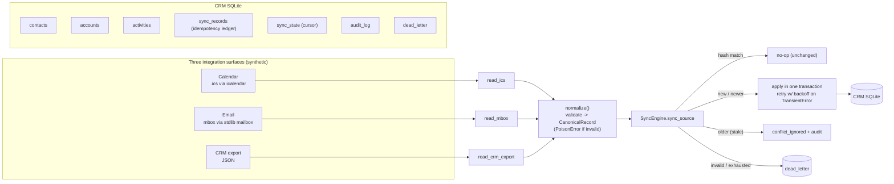

# integration-sync-sketch

A small, honest study of the patterns behind **syncing three unrelated systems into one
place and keeping them correct**: a calendar (ICS files), a mailbox (mbox), and a
CRM-shaped database. The sync is **idempotent** (safe to run again and again),
**incremental** (does only new work each run), and survives **duplicates, malformed
records, and flaky dependencies** without losing data.

**What it is in one line:** an independent, weekend-scale demo of integration-sync
engineering: natural keys, content hashes, cursors, a documented conflict policy, retry
with backoff, and a dead-letter queue, on synthetic self-authored data.

**What it is NOT:** a production connector. There are no real calendars, inboxes, CRMs,
credentials, or network calls. Every person, company, event, and message here is invented,
labeled `SYNTHETIC`, and uses reserved non-resolvable domains.

---

## The 30-second version

Three systems hold overlapping information about the same people:

- a **calendar** (real `.ics` files) of meetings,
- a **mailbox** (real `mbox` file) of emails, and
- a **CRM export** (JSON) of notes and tasks logged elsewhere.

A **sync engine** reads all three and writes each item once into a single CRM database as
an **activity** attached to a **contact** and an **account**. The hard part is not the
reading; it is staying correct when the same thing shows up twice, arrives out of order,
is broken, or the write fails halfway. This engine:

- never creates a duplicate (same item synced twice is a **no-op**),
- only does new work each run (an **incremental cursor** skips what it already has),
- resolves a genuine change with a **documented last-write-wins policy** and writes an
  **audit trail** of every decision,
- **retries** a flaky write with growing pauses, and
- sends anything it truly cannot process to a **dead-letter queue** for later, instead of
  crashing or silently dropping it.

Two runnable demos prove it:

```bash
python scripts/run_demo.py       # happy path: sync 3 sources, then prove a re-run changes nothing
python scripts/failure_demo.py   # inject duplicates, bad records, and flaky writes; watch each handled
```

---

## For engineers

### Architecture



### The five guarantees and how each is earned

| Guarantee | Mechanism | Where |
|---|---|---|
| **Idempotent** | every record has a source **natural key**; a **content hash** is stored per key in `sync_records`. Matching hash -> no writes, no audit rows. Duplicates in a batch collapse the same way. | `hashing.py`, `sync_engine._apply_once` |
| **Incremental** | a per-source **cursor** (high-water mark) in `sync_state`; the reader is handed the cursor and yields only records strictly newer. Cursor advances to the newest timestamp handled. | `sync_engine.sync_source`, readers' `since_iso` |
| **Conflict policy** | same key, **different** hash = a real change. Winner is the later `occurred_at` (ties broken deterministically by hash); the stale copy is ignored. Every create/update/conflict is written to `audit_log`. The conflict path is itself idempotent. | `sync_engine._decide` |
| **Retryable** | the write of a record runs in one transaction; a `TransientError` triggers **exponential backoff** and a clean retry (the transaction rolls back, so no partial state). | `retry.py`, `sync_engine._apply_with_retry` |
| **Dead-lettered** | a structurally invalid record (`PoisonError`) is queued immediately; a record that exhausts its retry budget is queued too. Rows carry payload, error, category, and failure count, and can be **reprocessed**. | `errors.py`, `sync_engine._dead_letter`, `reprocess_dead_letter` |

### Why these choices

- **Natural key + content hash, not "sync everything again".** The natural key
  (calendar UID, email `Message-ID`, CRM record id) is the stable identity the source
  itself guarantees. The content hash is computed over an **order-independent, whitespace-
  normalized** serialization of the meaningful fields, so cosmetic noise never looks like a
  change and any real edit always does. Together they make "have I seen this, and has it
  changed?" a single cheap lookup.
- **Cursor as a high-water mark, not a full diff.** Real connectors cannot re-read the
  whole source every run. A monotonic `occurred_at` watermark is the standard incremental
  primitive. Its honest limitation is called out below.
- **Last-write-wins *by event time*, with an audit trail, not blind LWW.** Using the
  source `occurred_at` (not wall-clock arrival) means out-of-order delivery still lands on
  the newest content. Writing every decision to `audit_log` means a resolution is never
  silent, which is what makes LWW defensible rather than lossy.
- **One transaction per record.** `contacts` + `accounts` + `activities` + `sync_records`
  + `audit_log` commit together or not at all, so a failed/ retried write can never leave a
  half-applied record. A test injects a fault on the first attempt and asserts zero orphan
  rows.
- **Poison vs. transient are different failures.** Retrying a malformed record just fails
  identically forever, so it is dead-lettered immediately. Retrying a flaky dependency
  usually works, so it backs off and retries, and is only dead-lettered after the budget is
  spent. Nothing is ever silently dropped.
- **SQLite, stdlib `mailbox`, and `icalendar`, chosen deliberately.** The interesting part
  of a sync connector is the *semantics* (identity, ordering, conflicts, failure), not the
  transport. SQLite gives real transactions and constraints in one file; `mailbox` and
  `icalendar` give real, standards-shaped inputs (mbox, RFC 5545) with zero services to
  run. This keeps the whole study `pip install` + `python` with no daemons.

### Data model (CRM SQLite)

Domain tables: `contacts` (keyed by email), `accounts` (keyed by name), `activities` (the
unified timeline, uniquely keyed by `(source, natural_key)`).

Sync bookkeeping: `sync_records` (idempotency ledger: last hash + version per key),
`sync_state` (cursor per source), `audit_log` (append-only decision trail), `dead_letter`
(poison + exhausted records with failure counts). Full DDL is in
[`integration_sync/crm_store.py`](integration_sync/crm_store.py).

### Failure modes the demo exercises

`scripts/failure_demo.py` injects, in one run: a duplicate (-> `unchanged`), an
out-of-order pair (-> newer wins, stale is `conflict_ignored` with audit), a record with an
invalid contact and one with no natural key (-> poison, dead-lettered), a record whose write
flakes twice then succeeds (-> retried with backoff), a record whose write never succeeds
(-> dead-lettered after the budget), and finally a **reprocess** pass that drains the
recoverable dead-letter once its dependency is "fixed" while correctly leaving the genuinely
poison rows queued.

### Tests

```bash
python -m pytest
```

43 tests, grouped by guarantee: `test_idempotency.py`, `test_incremental.py`,
`test_conflict.py`, `test_backoff.py`, `test_deadletter.py`, plus `test_normalize.py`
(validation + hashing), `test_sources.py` (ICS / mbox / JSON round-trips),
`test_demos.py` (end-to-end), and `test_no_company_names.py` (a repo-hygiene guard).

### Honest limitations

- **Watermark boundary.** The cursor is a timestamp, so two records sharing the exact same
  `occurred_at` at the boundary can be missed on a later incremental run (one advances the
  cursor, the other is then `<=` it). Standard high-water-mark caveat; a production system
  pairs the timestamp with a tiebreaker id or an overlap window. See RUNBOOK.
- **Single-process, single-writer.** No concurrency control beyond SQLite's own locking;
  this models one sync worker, not a fleet.
- **Synthetic scale.** A handful of records per source. The point is the semantics, not
  throughput; there is no batching, pagination, or rate-limit handling.
- **Simulated failures.** Transient errors are injected via a fault hook, not produced by a
  real flaky network. The retry/backoff logic is real; the fault is a stand-in.
- **Conflict policy is deliberately simple.** Last-write-wins by event time is auditable but
  not field-level merge; a real CRM sync might merge non-conflicting fields. The audit trail
  is what makes the simple policy safe to reason about.

### Layout

```
integration_sync/
  models.py          RawRecord / CanonicalRecord
  hashing.py         content hash (change detection)
  timeutil.py        UTC ISO normalization
  errors.py          TransientError vs PoisonError
  normalize.py       validation boundary (-> CanonicalRecord or PoisonError)
  calendar_source.py ICS read/write (icalendar)
  email_source.py    mbox read/write (stdlib mailbox)
  crm_import_source.py CRM JSON read/write
  crm_store.py       SQLite CRM target + sync bookkeeping + schema
  retry.py           backoff schedule + call_with_retry
  sync_engine.py     the engine
  pipeline.py        wiring for the demos
scripts/
  generate_synthetic_data.py
  run_demo.py        happy-path + idempotency demo
  failure_demo.py    failure-mode demo
tests/               43 tests
RUNBOOK.md           operating it: reprocessing, resetting a cursor, a stalled sync
```
